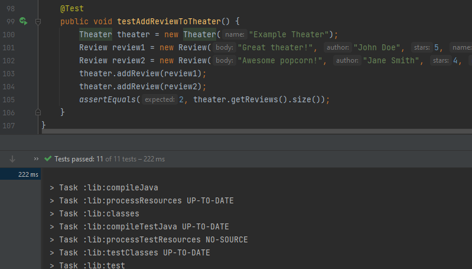

# Lab: Class 06

### overview 
 This lab Inheritance, Part 1 includes of two classes Restaurant and Review classes. 
 * Restaurant has a name, number of stars, and price category.
 * Review has a body, author, and number of stars.
 * The Review class has a Restaurant instance variable that is set when the Review is added to a Restaurant using the addReview method. 
-----------------------
### overview
This lab Inheritance, Part 2 includes:
*  Shop class which has a name, description, and number of dollar signs. It also implements the Reviewable interface which allows for reviews to be added to the shop. The class has a list of reviews, which is initially empty, and the addReview method allows for a new review to be added to the list.
* Theater class which has a name and a list of movies currently showing. It implements the Reviewable interface which allows for reviews to be added to the theater. The class has a list of reviews, which is initially empty, and the addReview method allows for a new review to be added to the list.
* additional instance variable - "movie" - in the Review class. This instance variable allows users to specify which movie they saw when reviewing a theater, while not requiring it when reviewing a Restaurant or a Shop.
The updated Shop and Theater classes have been updated to implement the modified Review interface. The addReview() methods have been updated in both classes to set the movie instance variable in the Review object if it is a Theater review.

### Test cases:

